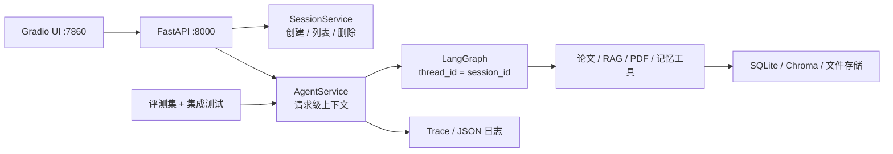
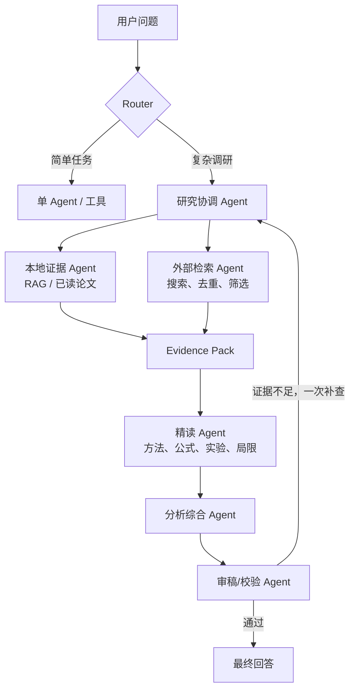

# 工程化与多 Agent 实施方案

> 目标：在 20 天内将科研助手从功能型个人项目升级为可本地部署、可多会话隔离、可测试、可观测的 Agent 服务，并为第二阶段多 Agent 工作流打好基础。

---

## 1. 已确定的约束

| 项目 | 决策 |
|------|------|
| 部署方式 | 本地 Docker Compose 一键运行 |
| Docker 环境 | 已可使用 Docker Desktop |
| 使用模式 | 多会话隔离展示，无需账号体系 |
| 会话管理 | 支持创建、列表、切换、删除 |
| 时间预算 | 约 20 天 |
| 当前优先级 | 先工程化，再引入多 Agent |

本阶段不做云部署、Redis、Kubernetes、登录鉴权、模型微调或复杂多 Agent。

---

## 2. 工程化目标架构



Docker Compose 包含两个服务：

- `api`：FastAPI、Agent、Chroma、SQLite、论文文件。唯一拥有数据写入权限。
- `ui`：Gradio 前端，通过 HTTP 调用 API，提供聊天和会话管理界面。

这样 UI 不持有 Agent 状态。切换浏览器或重启 UI 后，会话仍存在，也不会与其他会话串上下文。

---

## 3. 会话模型与 API

### 3.1 会话数据

新增独立会话表：

```text
sessions
  id
  title
  created_at
  updated_at
  last_message_preview
```

LangGraph checkpoint 继续保存消息历史，但配置中的 `thread_id` 必须等于 `session_id`。每次复杂任务另建 `task_id`，用于追踪 Worker 的中间结果。

### 3.2 API 设计

```text
POST   /api/v1/sessions
GET    /api/v1/sessions
DELETE /api/v1/sessions/{session_id}

POST   /api/v1/sessions/{session_id}/chat
POST   /api/v1/sessions/{session_id}/chat/stream

GET    /health
GET    /docs
```

删除会话时，按顺序删除：

1. LangGraph checkpoint 及关联的 writes/blobs；
2. 当前会话的对话摘要和 task trace；
3. `sessions` 表中的会话元数据。

全局论文库、科研笔记和已下载 PDF 不随会话删除。

### 3.3 并发规则

- 同一 `session_id` 串行执行，避免 checkpoint 并发写入和上下文乱序。
- 不同 `session_id` 可以并发执行。
- 流式回调只属于当前请求，不能继续使用全局 `_stream_cb`。
- Worker 的中间结果不直接写入用户会话；由协调 Agent 汇总后再写入最终结果。

---

## 4. 第一阶段：单 Agent 服务化

### 4.1 重点改造

当前代码需优先移除三处单会话设计：

1. 固定的 `research-main` thread id；
2. 全局 `_stream_cb` 流式回调；
3. `memory.py` 中固定绑定 `research-main` 的摘要。

请求级运行上下文应包含 `session_id`、`trace_id`、可选流式回调和当前任务元数据。可调用对象不写入 LangGraph checkpoint。

### 4.2 推荐目录

```text
app/
  main.py
  api/
    sessions.py
    chat.py
  services/
    agent_service.py
    session_service.py
  repositories/
    session_repository.py
  schemas.py
  observability.py
```

现有 `ResearchAgent` 保留为核心能力包装器，但不再承担全局会话状态；FastAPI 的 `AgentService` 负责组装请求上下文。

### 4.3 验收标准

- Swagger `/docs` 可创建、聊天、查询和删除会话。
- 两个会话同时聊天，历史、摘要和流式输出互不污染。
- 删除会话后再次访问返回 404，且对应状态确实被清理。
- 原有 CLI 仍可运行。

---

## 5. Docker、稳定性和可观测性

### 5.1 Docker 化

新增：

```text
Dockerfile
docker-compose.yml
.env.example
```

推荐使用 Python 3.11 镜像，并挂载数据卷保存：

- Chroma 向量库；
- SQLite 数据库；
- 下载 PDF 与图片；
- 结构化 Trace 日志。

目标命令：

```bash
docker compose up --build
```

启动后访问：

- `http://localhost:8000/docs`
- `http://localhost:7860`

### 5.2 Trace 字段

每个请求输出结构化 JSON 日志：

```text
trace_id / session_id / task_id / model / graph_node /
tool_name / retrieval_count / input_tokens / output_tokens /
duration_ms / error_type
```

### 5.3 稳定性与安全

- 每会话互斥锁；
- URL 下载大小、MIME 类型与内网地址校验；
- 外部 API 超时、有限重试和降级；
- API Key 不写入日志；
- `/health` 检查数据库、RAG 和模型配置状态。

---

## 6. 评测体系

新增 `evals/cases.jsonl`，包含 30–50 条固定任务：

- 是否应调用工具；
- 是否选对工具；
- 本地论文检索与来源引用；
- 外部检索、空结果和错误输入；
- PDF 下载、图片描述和超时降级；
- 多会话隔离与会话删除。

需要输出真实报告，而非仅描述“有测试”：

| 指标 | 含义 |
|---|---|
| 工具选择准确率 | 该调用工具时是否选择正确工具 |
| 检索引用正确率 | 结论是否能追溯到返回的论文 chunk |
| 任务完成率 | 固定任务集中的成功比例 |
| 延迟 | P50/P95 响应时间 |
| 成本 | 单任务平均 Token 和费用 |
| 稳定性 | 超时、空检索和无效输入时的受控降级情况 |

工程测试分层：

1. 纯函数和数据层单测；
2. Mock LLM / Mock Tool 的 LangGraph 集成测试；
3. FastAPI `TestClient` 接口测试；
4. 评测脚本与报告。

---

## 7. 第二阶段：多 Agent 工作流

### 7.1 适用范围

多 Agent 仅用于可并行、证据链长、需要比较推理的复杂任务，例如：

- 调研一个新方向；
- 比较多篇论文的方法和实验结论；
- 根据文献提出 TSN/6G 研究路线。

单篇追问、列出论文、简单知识问答继续走单 Agent 或直接工具调用。

### 7.2 Agent 分工



| Agent | 输入 | 输出 |
|---|---|---|
| Router | 用户问题、会话上下文 | `task_mode`、复杂度、是否多 Agent |
| 研究协调 Agent | 用户目标 | `ResearchPlan`、比较维度、Worker 任务 |
| 本地证据 Agent | 查询计划、本地库 | 本地 `Evidence[]` |
| 外部检索 Agent | 查询计划 | 候选论文 `PaperCandidate[]` |
| 精读 Agent | 入选论文 | 方法、公式、实验、局限的 `EvidencePack` |
| 分析综合 Agent | 全部证据 | `DraftAnswer` |
| 审稿/校验 Agent | 草稿、证据 | `PASS` 或 `RevisionRequest` |

### 7.3 交接协议

Agent 之间传递结构化对象，不传无限增长的自然语言上下文。例如：

```json
{
  "claim": "该方法将扩散模型用于生成调度策略",
  "paper_title": "Example Paper",
  "source_type": "local_rag",
  "page": 6,
  "chunk_id": "paper_x_chunk_12",
  "evidence": "原文片段",
  "confidence": 0.91
}
```

每个最终结论必须由至少一条 `Evidence` 支撑。审稿 Agent 检查证据、来源和结论之间是否一致。

### 7.4 成本控制

- Router 决定是否启用多 Agent；
- 本地/外部检索可并行，精读在论文筛选后进行；
- Worker 使用更低成本模型，协调和最终综合使用强模型；
- 每个复杂任务限制最多一次“证据不足”回环；
- 第一版最多四个模型角色，避免为角色而角色。

---

## 8. 20 天实施计划

| 时间 | 工作 | 交付物 |
|---|---|---|
| Day 1–2 | 架构设计、用户故事、接口与数据模型 | `ARCHITECTURE.md`、API 契约 |
| Day 3–6 | 会话隔离、AgentService、FastAPI + SSE | 会话 API、接口测试 |
| Day 7–8 | Gradio API 化、Dockerfile、Compose | 一键本地运行 |
| Day 9–12 | Mock LLM、集成测试、评测集与报告脚本 | 30–50 条评测任务 |
| Day 13–15 | Trace、错误分类、超时/重试、安全校验 | 结构化日志和稳定性测试 |
| Day 16–17 | Ruff、CI、README、架构图、演示样例 | 可复现项目文档 |
| Day 18–20 | 演示视频、简历表述、模拟面试 | 3 分钟 Demo 和项目讲稿 |

---

## 9. 面试可展示的完成定义

完成本方案后，应能清晰展示：

1. `docker compose up --build` 一键启动；
2. API 文档与 Gradio UI 同时可用；
3. 多会话互不串历史，删除可验证；
4. 请求 Trace 可定位模型、工具、检索和错误；
5. 评测报告包含真实质量、延迟和成本指标；
6. 多 Agent 只在复杂调研任务中启用，并有结构化证据链与成本控制。
